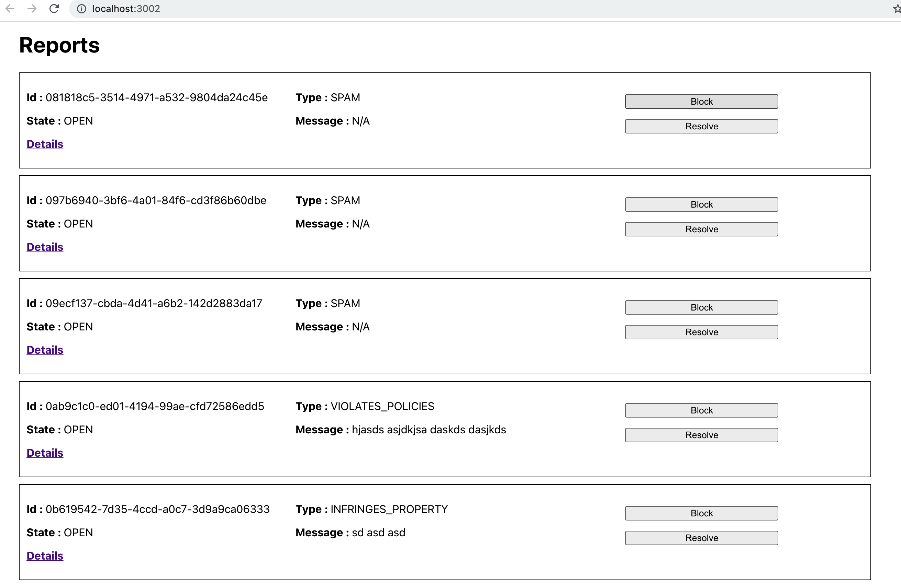
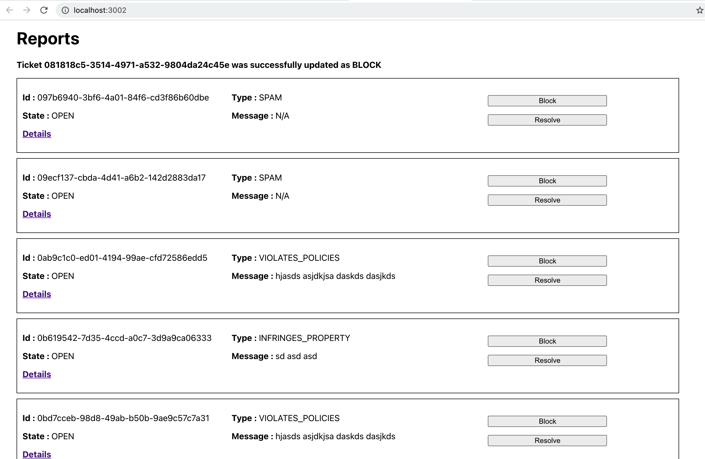
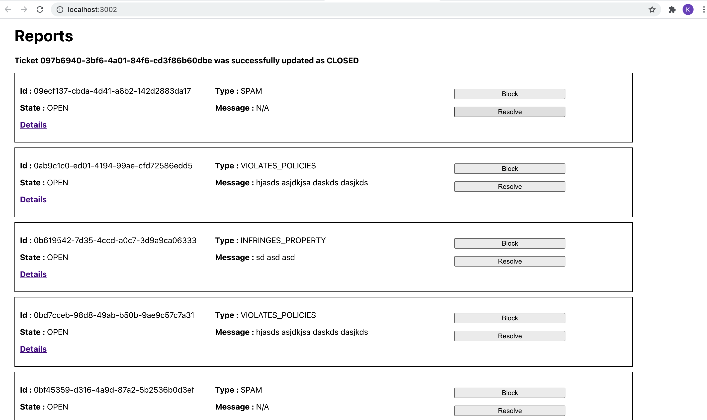

# Pre-requirements:
  - React-app(front end).
  - API gateway.
  - AWS lambda(node.js backend).
  - AWS RDS(mysql database).

## Work flow:
First, I will start with the pre-requirements.

We have a react-app to display the front-end UI, an AWS lambda where all the core node.js code, an API gateway to connect react-app and AWS lambda, and an AWS RDS database where all the tables are stored and managed.

To display the UI, react-app makes an HTTP GET request method to the API Gateway using the Get fetch API method. There are 2 methods Axios and fetch API. I am using fetch API. And then API gateway makes an HTTP GET request method to AWS lambda. I have made connections to  MySQL via AWS lambda. If the http_method is a get method, AWS lambda makes an SQL query to select all the data from the table where status is "open." And in return, MySQL returns an HTTP GET response in the JSON format to API gateway using AWS lambda. API gateway gives JSON-formatted response to react-app. And then, react-app converts the JSON data to HTML data and renders the function to the front-end UI.
 
An example of HTTP get method of UI is given below:

In the UI react-app, we have 2 main buttons, block and resolve. React-app checks which button clicked (either block or resolve). If a block is clicked, make an HTTP PUT request to the AWS lambda using API gateway. And then, AWS lambda makes a SQL query to update the state to "BLOCK" and display all the data from the RDS where the state is open. Also, display a message "Ticket with the "id" was successfully updated as "BLOCK.""
 
An example of HTTP PUT method of block is given below:

Whereas, if a resolve button is clicked, make an HTTP PUT request to the AWS lambda using API gateway. And then, AWS lambda makes a SQL query to update the state to "CLOSED" and display all the data from the RDS where the state is open.
Also, display a message "Ticket with the "id" was successfully updated as "CLOSED.""
 
An example of HTTP PUT method of resolve is given below:
